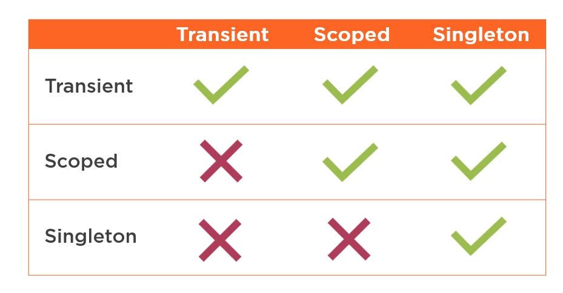
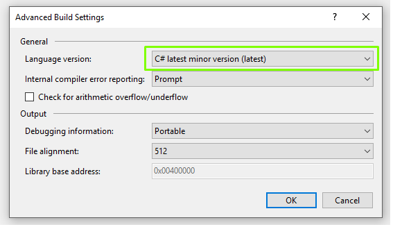
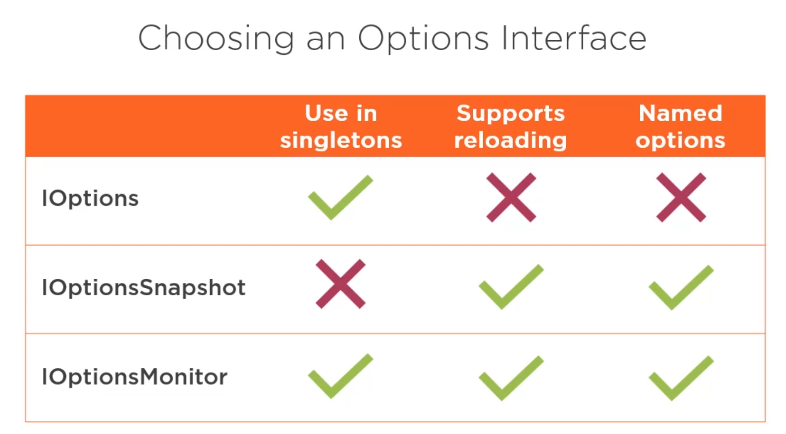

# .NET Core Dependency Injection

* [Microsoft Documentation](https://docs.microsoft.com/en-us/aspnet/core/fundamentals/dependency-injection?view=aspnetcore-2.2)
* [Dependency Injection in ASP.NET Core](https://app.pluralsight.com/library/courses/aspdotnet-core-dependency-injection/table-of-contents)
* [ASP.NET Dependency Injection Best Practices](https://medium.com/volosoft/asp-net-core-dependency-injection-best-practices-tips-tricks-c6e9c67f9d96?fbclid=IwAR2Bdh6IySRyWQgHOZITE_RvmeAlxV1GJFUHrIy5Y8tMuEF2GGo8FTWbziY)
* The most parameter rich constructor will be used to create object.
* When injecting IServiceProvider into a singleton it is the root provider so can't get scoped services.

## Safe Registrations
* Singleton Service validation occurs in development to ensure scoped services aren't injected.



## Configuration
```
services.Configure<AppSettings>(Configuration.GetSection("AppSettings"));
services.AddTransient(sp => sp.GetService<IOptions<AppSettings>>().Value);

var settings = Configuration.GetSection(sectionKey).Get<AppSettings>();
```

## Multiple Registrations
* If there are multiple registrations for the same service type the last registered type wins.
* TryAdd will only register if there is not already a service defined for that service type.
* services.TryAddEnumerable prevents duplication of service type. Useful for composite services which send notifications.
* Resolve multiple services with IEnumerable<IServiceType>, IServiceType[], servicePrvider.GetServices<INotificationService>(), servicePrvider.GetServices(typeof(INotificationService))

```
//Add EmailNotificationService once
servcies.AddSingleton<INotificationService, EmailNotificationService>();
servcies.TryAddSingleton<INotificationService, EmailNotificationService>();

//Add EmailNotificationService twice. Last wins if calling servicePrvider.GetService or injecting INotificationService
servcies.AddSingleton<INotificationService, EmailNotificationService>();
servcies.AddSingleton<INotificationService, EmailNotificationService>();

//Add EmailNotificationService only once
services.TryAddEnumerable(ServiceDescriptor.Singleton<INotificationService, EmailNotificationService>());
services.TryAddEnumerable(ServiceDescriptor.Singleton<INotificationService, EmailNotificationService>());
```

## Clear and Replace Registrations
```
services.RemoveAll<INotificationService>();
services.Replace(ServiceDescriptor.Singleton<INotificationService, EmailNotificationService>());
```

## Type as Multiple Interfaces
```
services.AddSingleton<GreetingService>();

servies.AddSingleton<IHomePageGreetingService>(sp => sp.GetRequiredService<GreetingService>());
servies.AddSingleton<IGreetingService>(sp => sp.GetRequiredService<GreetingService>());
```

## Notifications
```
servcies.AddSingleton<EmailNotificationService>();
servcies.AddSingleton<SmsNotificationService>();

services.AddSingleton<INotificationService>(sp => new CompositeNotificationService(new INotificationService[]
{ 
	sp.GetRequiredService<EmailNotificationService>(),
	sp.GetRequiredService<SmsNotificationService>()
}));
```

## Open Generic Services
```
services.AddSingleton(typeof(IDistributedCache<>), typeof(DistributedCache<>));
```

## Extensions for Cleaner Code
```
public static class ConfigurationServiceCollectionExtensions
{
	public static IServiceCollection AddAppConfiguration(this IServiceCollection services)
	{
	}
}
```
## Activator Utilities
* Can be used to construct an object not registered in container with an IServiceProvider.

## Action Injection
* [FromServices] attribute allows dependencies to be resolved for a single action.
 
## Middleware Injection

* Constructor injection only allows singleton service lifetime.
* Can pass dependencies into InvokeAsync which supports all service lifetimes.

```
public class Middleware
{
	private readonly RequestDelegate _next;
	Public Middleware(RequestDelegate next)
	{
		_next = next;
	}
	
	public async Task InvokeAsync(HttpContext context, UserManager<User> userManager)
	{
	
	}
}
```

## View Injection
* @inject AppSettings AppSettings

## Manaully creating scope

* Enable Async Main



```
public class Program
{
	public static async Task Main (string[] args)
	{
		var webHost = CreateWebHostBuilder(args).Build();

		using (var scope = webHost.Services.CreateScope())
		{
			var serviceProvider = scope.ServiceProvider;

			var hostingEnvironment = serviceProvider.GetRequiredService<IHostingEnvironment>();
			var appLifetime = serviceProvider.GetRequiredService<IApplicationLifetime>();
			
			if (hostingEnvironment.IsDevelopment())
			{
				var ctx = serviceProvider.GetRequiredService<TennisBookingDbContext>();
				await ctx.Database.MigrateAsync(appLifetime.ApplicationStopping);

				try
				{
					var userManager = serviceProvider.GetRequiredService<UserManager<TennisBookingsUser>>();
					var roleManager = serviceProvider.GetRequiredService<RoleManager<TennisBookingsRole>>();

					await SeedData.SeedUsersAndRoles(userManager, roleManager);
				}
				catch (Exception ex)
				{
					var logger = serviceProvider.GetRequiredService<ILoggerFactory>().CreateLogger("UserInitialisation");
					logger.LogError(ex, "Failed to seed user data");
				}
			}
		}

		webHost.Run();
	}

	public static IWebHostBuilder CreateWebHostBuilder(string[] args) =>
		WebHost.CreateDefaultBuilder(args)
			.ConfigureServices(services => services.AddAutofac())
			.UseStartup<Startup>();
}
```

## Scrutor - Simple .NET Core container assembly scanning and decorators
```
services.Scan(scan => scan.FromAssemblyOf<Interface>()
						  .AddClasses(c => c.AssignableTo<Interface>())
						  .AsImplementedInterfaces()
						  .WithScopedLifetime());
```

```
services.Scan(scan => scan.FromAssemblyOf<Interface>()
						  .AddClasses(c => c.AssignableTo<ScopedInterface>())
						  .As<Interface>()
						  .WithScopedLifetime())
						  .AddClasses(c => c.AssignableTo<SingletonInterface>())
						  .As<Interface>()
						  .WithSingletonLifetime());
```

Decorator functionality is useful for wrapping libraries with caching.
```
public CachedWeatherForecaster : IWeatherForecaster
{
	private readonly IWeatherForecaster _weatherForecaster;
	private readonly IDistributedCache<Result> _cache;
	
	public CachedWeatherForecaster(IWeatherForecaster weatherForecaster, IDistributedCache<Result> cache)
	{
		_weatherForecaster = weatherForecaster;
		_cache = cache;
	}
	
	public async Task<CurrentWeatherResult> GetCurrentWeatherAsync()
	{
		var cacheKey = $"current_weather_{DateTime.UtcNow:yyyy_MM_dd}";

		var (isCached, forecast) = await _cache.TryGetValueAsync(cacheKey);

		if (isCached)
			return forecast;

		var result = await _weatherForecaster.GetCurrentWeatherAsync();

		await _cache.SetAsync(cacheKey, result, 60);

		return result;
	}
}

services.AddHttpClient<IWeatherClient, WeatherApiClient>();
services.AddSingleton<IWeatherForecaster, WeatherForecaster>();
services.Decorate<IWeatherForecaster, CachedWeatherForecaster>();
```

## Autofac
* Autofac.Extensions.DependencyInjection

```
using Autofac;
using Autofac.Extensions.DependencyInjection;
using Microsoft.AspNetCore.Hosting;
using Microsoft.Extensions.DependencyInjection;
using System;

namespace AspNetCore.Base.DependencyInjection
{
    public static class AutofacExtensions
    {
        public static IServiceCollection AddAutofac(this IServiceCollection services)
        {
            return services.AddSingleton<IServiceProviderFactory<ContainerBuilder>, AutofacServiceProviderFactory>();
        }

        public static IWebHostBuilder UseAutofac(this IWebHostBuilder builder)
        {
            return builder.ConfigureServices(services => services.AddAutofac());
        }

        private class AutofacServiceProviderFactory : IServiceProviderFactory<ContainerBuilder>
        {
            public ContainerBuilder CreateBuilder(IServiceCollection services)
            {
                var containerBuilder = new ContainerBuilder();

                containerBuilder.Populate(services);

                return containerBuilder;
            }

            public IServiceProvider CreateServiceProvider(ContainerBuilder builder)
            {
                var container = builder.Build();
                return new AutofacServiceProvider(container);
            }
        }
    }
}
```
```
public class Program
{
	public static async Task Main (string[] args)
	{
		var webHost = CreateWebHostBuilder(args).Build();

		using (var scope = webHost.Services.CreateScope())
		{
			var serviceProvider = scope.ServiceProvider;

			var hostingEnvironment = serviceProvider.GetRequiredService<IHostingEnvironment>();
			var appLifetime = serviceProvider.GetRequiredService<IApplicationLifetime>();
			
			if (hostingEnvironment.IsDevelopment())
			{
				var ctx = serviceProvider.GetRequiredService<TennisBookingDbContext>();
				await ctx.Database.MigrateAsync(appLifetime.ApplicationStopping);

				try
				{
					var userManager = serviceProvider.GetRequiredService<UserManager<TennisBookingsUser>>();
					var roleManager = serviceProvider.GetRequiredService<RoleManager<TennisBookingsRole>>();

					await SeedData.SeedUsersAndRoles(userManager, roleManager);
				}
				catch (Exception ex)
				{
					var logger = serviceProvider.GetRequiredService<ILoggerFactory>().CreateLogger("UserInitialisation");
					logger.LogError(ex, "Failed to seed user data");
				}
			}
		}

		webHost.Run();
	}

	public static IWebHostBuilder CreateWebHostBuilder(string[] args) =>
		WebHost.CreateDefaultBuilder(args)
			.UseAutofac())
			.UseStartup<Startup>();
}
```
```
using Microsoft.AspNetCore.Builder;
using Microsoft.AspNetCore.Hosting;
using Microsoft.AspNetCore.Http;
using Microsoft.AspNetCore.Identity;
using Microsoft.AspNetCore.Mvc;
using Microsoft.EntityFrameworkCore;
using Microsoft.Extensions.Configuration;
using Microsoft.Extensions.DependencyInjection;
using System;
using Autofac;

public class Startup
{
	public Startup(IConfiguration configuration)
	{
		Configuration = configuration;
	}

	public IConfiguration Configuration { get; }

	public void ConfigureServices(IServiceCollection services)
	{            
		services.Configure<CookiePolicyOptions>(options =>
		{                
			options.CheckConsentNeeded = context => true;
			options.MinimumSameSitePolicy = SameSiteMode.None;
		});

		services.AddMvc()
			.AddRazorPagesOptions(options =>
			{
				options.Conventions.AuthorizePage("/FindAvailableCourts");
				options.Conventions.AuthorizePage("/BookCourt");
				options.Conventions.AuthorizePage("/Bookings");
			})
			.SetCompatibilityVersion(CompatibilityVersion.Version_2_2);

		services.AddIdentity<TennisBookingsUser, TennisBookingsRole>()
			.AddEntityFrameworkStores<TennisBookingDbContext>()
			.AddDefaultUI()
			.AddDefaultTokenProviders();

		services.AddDbContext<TennisBookingDbContext>(options =>
			options.UseSqlServer(
				Configuration.GetConnectionString("DefaultConnection")));           
	}
	
	// This method is called after ConfigureServices
	public void ConfigureContainer(ContainerBuilder builder)
	{

	}

	public void Configure(IApplicationBuilder app, IHostingEnvironment env, IServiceProvider serviceProvider)
	{
		if (env.IsDevelopment())
		{
			app.UseDeveloperExceptionPage();
		}
		else
		{
			app.UseExceptionHandler("/Home/Error");
			app.UseHsts();
		}

		app.UseHttpsRedirection();
		app.UseStaticFiles();
		app.UseAuthentication();
		app.UseCookiePolicy();

		app.UseLastRequestTracking(); // only track requests which make it to MVC, i.e. not static files
		app.UseMvc();
	}
}
```

## Configuration
* .ValidateDataAnnotations and IValidateOptions validates config on first use. Better to use IStartupFilter to validate on application startup.
* services.TryAddEnumerable(ServiceDescriptor.Singleton<IValidateIotions<OptionsClass>, OptionsValidationClass>());
* Use Options.Create(); for Unit Testing
* IOptionsMonitor<T> use:
```
_options = options.CurrentValue;
options.OnChange(config => {
	_options = config;
	logger.LogInformation("Configuration has been updated");
});
```



### IOptions
* Does not support options reloading
* Registered as a singleton in DI container
* Values bound when first used
* Can be injected into all service lifetimes
* Does not support named options

### IOptionsSnapshot
* Supports reloading of configuration
* Registered as scoped in DI container
* Values may reload per request
* Can not be injected into singleton services
* Supports named options

### IOptionsMonitor
* Supports reloading of configuration
* Registered as singleton b in DI container
* Values are reloaded immediately
* Can be injected into all service lifetimes
* Supports named options

### Providers
1. appsettings.json
2. appsettings.{environment}.json
3. Local user secrets in development environment
4. Environment variables
5. Command line args
6. Azure Key Vault/EF

* Use the following to have control over order
```
.ConfigureAppConfiguration((ctx, builder) => {
	builder.Sources.Clear();

	var env = ctx.HostingEnvironment;
	builder.AddJsonFile("appsettings.json", optional: true, reloadOnChange: true);

	if(env.IsDevelopment() && !string.ISnullOrEmpty(env.ApplicationName))
	{
		var appAssembly = Assembly.Load(new AssemblyName(env.ApplicationName))
		if(appAssembly != null)
		{
			builder.AddUserSecrets(appAssembly, optional: true);
		}
	}

	var tokenProvider = new AzureServiceTokenProvider();
	var kvClient = new KeyVaultClient((authority, resource, scope) => tokenProvider.KeyVaultTokenCallback(authority, resource, scope));
	builder.AddAzureKeyVault($"https://{vaultName}.vault.azure.net", kvClient, new DefaultKeyVaultSecretManager());

	builder.AddEnvironmentVariables();
});
```

### Environment Variables
* Command Line. set Section__Key=Value
* Can also be set in launchSettings.json. "Section__Key" : "Value"

### Command Line Args
* dotnet run --Section:Key Value

### User Secrets
* dotnet user-secrets list
* Good for Development envvironment

### Azure Key Vault
* Good for production

### EF Core
* Section:Key
```
public class ConfigurationEntry
{
	[Key]
	public string Key {get; set;}

	public string Value {get; set;}
}
```